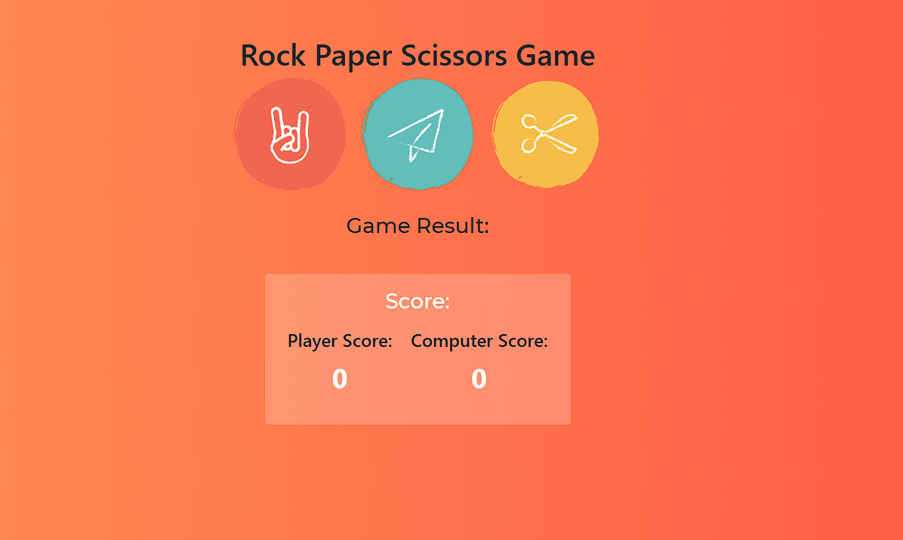

# Rock Paper Scissors Game

A simple Rock Paper Scissors game built with HTML, CSS, and JavaScript.

## Description

This is a classic Rock Paper Scissors game where the player can choose either rock, paper, or scissors, and compete against the computer. The game follows the traditional rules: rock beats scissors, scissors beats paper, and paper beats rock. The score is kept track of, and the first player to reach a specified score limit wins the game.

## Features

- Player vs Computer gameplay
- Random selection for the computer's choice
- Score tracking for both the player and the computer
- Game result display for each round
- Ability to set a custom score limit to win the game

## Screenshots

## How to Play

1. Open the game in a web browser.
2. Select your choice (rock, paper, or scissors) by clicking on the corresponding button.
3. The computer will randomly select its choice.
4. The game result will be displayed, indicating whether the player or the computer won the round.
5. The score will be updated accordingly.
6. Continue playing until either the player or the computer reaches the specified score limit to win the game.

## Getting Started

To run the game locally, follow these steps:

1. Clone the repository: `git clone https://github.com/your-username/rock-paper-scissors.git`
2. Navigate to the project directory: `cd rock-paper-scissors`
3. Open the index.html file in a web browser.

## Technologies Used

- HTML
- CSS
- JavaScript

## License

This project is licensed under the [MIT License](LICENSE).

## Acknowledgements

This game was created as a learning project and may contain code snippets or inspiration from various sources.
